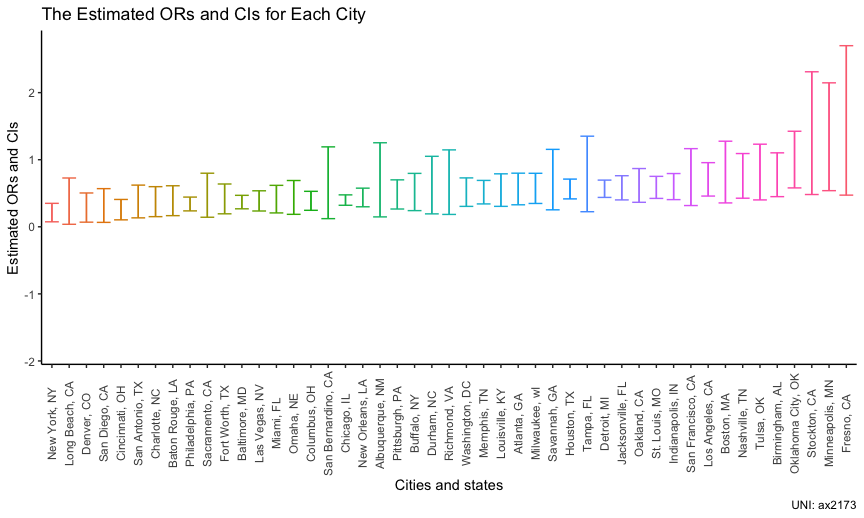
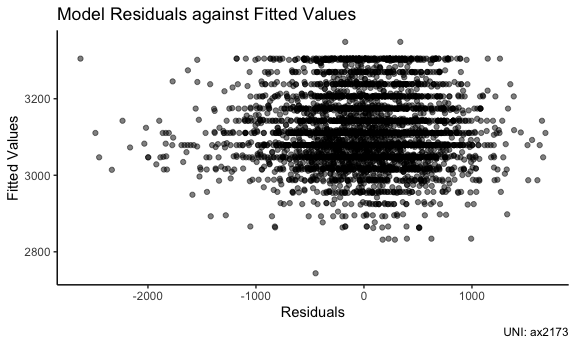

p8015_hw6_ax2173
================

``` r
library(tidyverse)
```

    ## ── Attaching packages ─────────────────────────────────────── tidyverse 1.3.2 ──
    ## ✔ ggplot2 3.3.6      ✔ purrr   0.3.5 
    ## ✔ tibble  3.1.8      ✔ dplyr   1.0.10
    ## ✔ tidyr   1.2.1      ✔ stringr 1.4.1 
    ## ✔ readr   2.1.2      ✔ forcats 0.5.2 
    ## ── Conflicts ────────────────────────────────────────── tidyverse_conflicts() ──
    ## ✖ dplyr::filter() masks stats::filter()
    ## ✖ dplyr::lag()    masks stats::lag()

``` r
library(modelr)
library(viridis)
```

    ## Loading required package: viridisLite

``` r
library(mgcv)
```

    ## Loading required package: nlme
    ## 
    ## Attaching package: 'nlme'
    ## 
    ## The following object is masked from 'package:dplyr':
    ## 
    ##     collapse
    ## 
    ## This is mgcv 1.8-40. For overview type 'help("mgcv-package")'.

``` r
knitr::opts_chunk$set(
  fig.width = 6,
  fig.asp = .6,
  out.width = '90%'
)

theme_set(theme_classic() + theme(legend.position = 'bottom'))

options(
  ggplot2.continous.colour = 'viridis_d',
  ggplot2.continous.fill = 'viridis_d'
)

scalr_colour_discrete = scale_color_viridis_d
scale_fill_discrete = scale_fill_viridis_d

set.seed(1)
```

## Problem 1

## Problem 2

Import the data, and do some initial data manipulations, described as
following:

-   Create a city_state variable
-   Create a binary variable indicating whether the homicide is solved.
    (1 represents solved, 0 represents unsolved)
-   Omit several cities
-   Limit analysis those for whom victim_race is white or black
-   Change the type of victim_age to numeric

``` r
homicide_df = 
  read_csv("./data/homicide-data.csv") %>% 
  janitor::clean_names() %>% 
  mutate(
    city_state = str_c(city, ', ',state),
    whether_solve = ifelse(str_detect(disposition, 'Close'), 1, 0)
  ) %>% 
  select(-city, -state, -disposition) %>% 
  filter(
    !city_state %in% c('Dallas, TX', 'Phoenix, AZ','Kansas City, MO','Tulsa, AL'),
    victim_race %in% c('White','Black')
    ) %>% 
  filter(victim_age != 'Unknown') %>% 
  mutate(victim_age = as.numeric(victim_age))
```

    ## Rows: 52179 Columns: 12
    ## ── Column specification ────────────────────────────────────────────────────────
    ## Delimiter: ","
    ## chr (9): uid, victim_last, victim_first, victim_race, victim_age, victim_sex...
    ## dbl (3): reported_date, lat, lon
    ## 
    ## ℹ Use `spec()` to retrieve the full column specification for this data.
    ## ℹ Specify the column types or set `show_col_types = FALSE` to quiet this message.

For the city of Baltimore, MD, use the glm function to fit a logistic
regression with resolved vs unresolved as the outcome and victim age,
sex and race as predictors. Save the output of glm as an R object, and
apply the broom::tidy to this object.

``` r
homicide_Bal_df = 
  homicide_df %>% 
  filter(city_state == 'Baltimore, MD') 

Bal_glm = 
  glm(whether_solve ~ victim_age + victim_sex + victim_race, family = binomial(link = logit), data = homicide_Bal_df) %>% 
  broom::tidy()
```

As for solving homicides comparing male victims to female victims
keeping all other variables fixed, we can get these two things:

-   The estimated odds ratio is -1.037
-   The 95% confidence interval is (-1.316,-0.757)

Now run glm for each of the cities in your dataset, and extract the
adjusted odds ratio (and CI) for solving homicides comparing male
victims to female victims.

``` r
homicide_df_models = 
  homicide_df %>% 
  nest(data = -city_state) %>% 
  mutate(
    models = purrr::map(.x = data, ~glm(whether_solve ~ victim_age + victim_sex + victim_race, family = binomial(link = logit), data = .x)),
    result = purrr::map(models, broom::tidy)
    ) %>% 
  select(-data, -models) %>% 
  unnest(result) %>% 
  filter(term == 'victim_sexMale') %>% 
  mutate(
    CI_lowerbond = estimate - 1.96 * std.error,
    CI_upperbond = estimate + 1.96 * std.error,
  ) %>% 
  select(city_state, estimate, CI_lowerbond, CI_upperbond) 

homicide_df_models %>% knitr::kable(digits = 3)
```

| city_state         | estimate | CI_lowerbond | CI_upperbond |
|:-------------------|---------:|-------------:|-------------:|
| Albuquerque, NM    |   -0.844 |       -1.913 |        0.225 |
| Atlanta, GA        |   -0.669 |       -1.115 |       -0.224 |
| Baltimore, MD      |   -1.037 |       -1.316 |       -0.757 |
| Baton Rouge, LA    |   -1.143 |       -1.795 |       -0.491 |
| Birmingham, AL     |   -0.351 |       -0.800 |        0.098 |
| Boston, MA         |   -0.395 |       -1.033 |        0.244 |
| Buffalo, NY        |   -0.825 |       -1.422 |       -0.228 |
| Charlotte, NC      |   -1.201 |       -1.889 |       -0.514 |
| Chicago, IL        |   -0.939 |       -1.137 |       -0.742 |
| Cincinnati, OH     |   -1.582 |       -2.267 |       -0.897 |
| Columbus, OH       |   -1.020 |       -1.403 |       -0.637 |
| Denver, CO         |   -1.679 |       -2.673 |       -0.685 |
| Detroit, MI        |   -0.594 |       -0.826 |       -0.362 |
| Durham, NC         |   -0.798 |       -1.646 |        0.050 |
| Fort Worth, TX     |   -1.046 |       -1.642 |       -0.449 |
| Fresno, CA         |    0.121 |       -0.751 |        0.993 |
| Houston, TX        |   -0.609 |       -0.877 |       -0.341 |
| Indianapolis, IN   |   -0.567 |       -0.903 |       -0.231 |
| Jacksonville, FL   |   -0.593 |       -0.914 |       -0.273 |
| Las Vegas, NV      |   -1.034 |       -1.446 |       -0.622 |
| Long Beach, CA     |   -1.802 |       -3.286 |       -0.318 |
| Los Angeles, CA    |   -0.413 |       -0.781 |       -0.045 |
| Louisville, KY     |   -0.712 |       -1.188 |       -0.236 |
| Memphis, TN        |   -0.722 |       -1.076 |       -0.369 |
| Miami, FL          |   -1.029 |       -1.576 |       -0.481 |
| Milwaukee, wI      |   -0.641 |       -1.056 |       -0.226 |
| Minneapolis, MN    |    0.073 |       -0.619 |        0.764 |
| Nashville, TN      |   -0.382 |       -0.853 |        0.088 |
| New Orleans, LA    |   -0.880 |       -1.209 |       -0.552 |
| New York, NY       |   -1.824 |       -2.598 |       -1.051 |
| Oakland, CA        |   -0.574 |       -1.008 |       -0.141 |
| Oklahoma City, OK  |   -0.096 |       -0.545 |        0.354 |
| Omaha, NE          |   -1.027 |       -1.683 |       -0.371 |
| Philadelphia, PA   |   -1.127 |       -1.439 |       -0.814 |
| Pittsburgh, PA     |   -0.842 |       -1.328 |       -0.357 |
| Richmond, VA       |   -0.777 |       -1.691 |        0.137 |
| San Antonio, TX    |   -1.246 |       -2.015 |       -0.476 |
| Sacramento, CA     |   -1.087 |       -1.949 |       -0.225 |
| Savannah, GA       |   -0.615 |       -1.374 |        0.143 |
| San Bernardino, CA |   -0.966 |       -2.108 |        0.175 |
| San Diego, CA      |   -1.642 |       -2.721 |       -0.564 |
| San Francisco, CA  |   -0.498 |       -1.150 |        0.153 |
| St. Louis, MO      |   -0.573 |       -0.860 |       -0.285 |
| Stockton, CA       |    0.053 |       -0.731 |        0.838 |
| Tampa, FL          |   -0.596 |       -1.493 |        0.301 |
| Tulsa, OK          |   -0.353 |       -0.914 |        0.208 |
| Washington, DC     |   -0.753 |       -1.189 |       -0.316 |

Create a plot that shows the estimated ORs and CIs for each city.
Organize cities according to estimated OR, and comment on the plot.

``` r
homicide_df_models %>% 
  mutate(city_state = fct_reorder(city_state, estimate)) %>% 
  ggplot(aes(city_state, estimate, color = city_state)) +
  geom_linerange(aes(ymin = CI_lowerbond, ymax = CI_upperbond)) +
  geom_errorbar(aes(ymin = CI_lowerbond, ymax = CI_upperbond), width = 0.8) +
  theme(axis.text.x = element_text(angle = 90, hjust = 0.5, vjust = 0.5)) +
  theme(legend.position = 'none') +
  labs(
    title = 'The Estimated ORs and CIs for Each City',
    x = 'Cities and states',
    y = 'Estimated ORs and CIs',
    caption = 'UNI: ax2173'
  )
```



Comments on this plot:

-   The lowest estimated OR goes to New York, NY
-   The highest estimated OR goes to Fresno, CA
-   The widest CI goes to Long Beach, CA
-   The narrowest CI goes to Chicago, IL

## Problem 3

Import the data, load and clean the data for regression analysis.

``` r
weight_df = 
  read_csv('./data/birthweight.csv') %>% 
  janitor::clean_names() %>% 
  mutate(
    babysex = as.factor(babysex),
    frace = as.factor(frace),
    mrace = as.factor(mrace),
    malform = as.factor(malform)
    ) %>% 
  drop_na()
```

    ## Rows: 4342 Columns: 20
    ## ── Column specification ────────────────────────────────────────────────────────
    ## Delimiter: ","
    ## dbl (20): babysex, bhead, blength, bwt, delwt, fincome, frace, gaweeks, malf...
    ## 
    ## ℹ Use `spec()` to retrieve the full column specification for this data.
    ## ℹ Specify the column types or set `show_col_types = FALSE` to quiet this message.

Propose a regression model for birthweight, and the modeling process: I
make some hypothesis about these factors to effect the birth weight:

-   fincome (family monthly income): the family richer, more nutrition
    the mothers get;
-   malform (presence of malformations): the presence of malformations
    tend to effect the birth weight;
-   pnumlbw (previous number of low birth weight babies): the more
    previous number of low birth weight babies, the larger probability
    this baby present the low birth weight;
-   smoken (average number of cigarettes smoked per day during
    pregnancy): smoking during pregnancy tend to effect the birth weigh.

``` r
bw_reg = lm(bwt ~ fincome + malform + pnumlbw + smoken, data = weight_df)
```

Show a plot of model residuals against fitted values – use
add_predictions and add_residuals in making this plot.

``` r
weight_df %>% 
  add_predictions(bw_reg) %>% 
  add_residuals(bw_reg) %>% 
  ggplot(aes(x = resid, y = pred)) +
  geom_point(alpha = .5)
```

    ## Warning in predict.lm(model, data): prediction from a rank-deficient fit may be
    ## misleading

    ## Warning in predict.lm(model, data): prediction from a rank-deficient fit may be
    ## misleading


